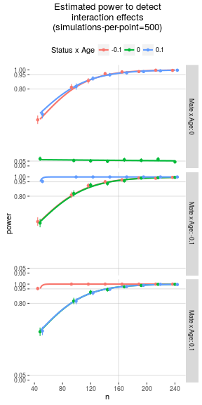

    library(ndl)
    library(tidyr)
    library(dplyr)
    library(parallel)
    library(lme4)
    library(MASS)
    library(ggplot2)
    library(knitr)

    Simulate <- function(k, n, icc, beta, X=NA, sigma=NA, sigmaXre=NA){
        #k is number of groups
        #n is observations per group
        #icc is the population interclass-correlation
        #beta is the vector of fixed effect parameter weights
        #X, if provided, should not include the intercept, and should first
        # rotate observations within-group, then between
        #sigma is the covariance matrix of the fixed effect variables
        #sigmaXre is the covariance matrix of the random effects where 0 indicates no RE
        require(MASS)
        nk <- n*k
        nx <- length(beta)-1
        Z <- kronecker(diag(k), rep(1,n))
    #
        if(is.na(X[1])){ #no X matrix provided
            # X matrix
            if (is.na(sigma[1])) sigma <- diag(nx)
            X <- mvrnorm(nk, rep(0,nx), sigma)
            userX <- FALSE
        } else {
            #check that that X matrix is correct size
            if(dim(X)[1] != nk) stop('X matrix is not correct length (n*k)')
            if(dim(X)[2] != length(beta)-1) stop('X matrix is correct width (length(betas)-1)')
            userX <- TRUE
        }
    #
        # random effects of X
        if (!is.na(sigmaXre[1])){
            Xre <- t(matrix(rnorm(k*nx,rep(1,nx),sigmaXre),nrow=nx))
            Xre <- cbind(rep(1,nk), X * (Z %*% Xre))
        } else {
            Xre <- cbind(rep(1,nk), X)
        }
        X <- cbind(rep(1,nk), X)
    #
        # create a factor to keep track of which “students” are in which “school”
        group <- as.factor(rep(1:k, each=n))
    #
        # generate taus and epsilons
        tecov <- diag(c(icc, rep(1-icc,n)))
        te <- mvrnorm(k, rep(0,n+1), tecov)
        epsilons <- as.vector(t(te[,-1]))
        taus <- te[,1]
    #
        # generate Y data
        ran <- Z %*% taus + epsilons
        Y <- Xre %*% beta + ran
    #
        output <- as.data.frame(X[,-1])
        output$Y <- Y
        output$group <- group
        return(output)
    }
    simAnalysis <- function(simParams, agerange){
        N <- as.numeric(length(agerange)*simParams[['NperAge']]) 
        icc <- as.numeric(simParams[['icc']])
        condition <- factor(c('social','status','mateseek'), levels=c('social','status','mateseek'))
        age <- rep(agerange-mean(agerange), each=N/length(agerange))
        simDF <- as.data.frame(expand.grid(condition=condition,age=age))
        aModMat <- model.matrix(~condition*age, data=simDF)
        FEbetas <- as.numeric(simParams[1:6])
        FEsigma <- diag(length(FEbetas))
        REsigma <- matrix(rep(0,(length(FEbetas)-1)^2), length(FEbetas)-1)

        mlm_sim_output <- Simulate(k=N, n=3, icc=icc, beta=FEbetas,
                                   X=aModMat[,-1], sigma=FEsigma, sigmaXre=REsigma)
        simDF$alphaExp <- mlm_sim_output$Y
        simDF$group <- mlm_sim_output$group

        modAgeCond <- lmer(alphaExp~1+condition+age+(1|group), data=simDF, REML=F) 
        modAgeCondX <- lmer(alphaExp~1+condition*age+(1|group), data=simDF, REML=F)
        modComp <- anova(modAgeCond, modAgeCondX)[,c(1,2,3,5)] 
        modCompSum <- (modComp[1,]-modComp[2,])
        return(bind_cols(as.data.frame(simParams), modCompSum))
    }

    simAnalysisReplications <- function(simParams, agerange, n=1){
        #run n replications of a particular simulated analysis using simAnalysis
        return(replicate(n, simAnalysis(simParams,  agerange=agerange), simplify=F))
    }

    agerange <- 11:22
    NperAge <- c(4, 8, seq(10,20,2))
    Niter <- 500
    b0 <- 0
    b1.stat <- c(0, .3, -.3)
    b2.mate <- b1.stat
    b3.age <- b1.stat
    b4.statXage <- c(0, .1, -.1) 
    b5.mateXage <- c(0, .1, -.1) 
    icc <- c(.25, .5, .75)

    simParams <- as.data.frame(expand.grid(b0, b1.stat, b2.mate, b3.age, b4.statXage, b5.mateXage, NperAge, icc))
    names(simParams) <- c('b0', 'b1.stat', 'b2.mate', 'b3.age', 'b4.statXage', 'b5.mateXage', 'NperAge', 'icc') 

    simParamList <- split(simParams, 1:dim(simParams)[1])

    if(!file.exists('simRezDF.RDS')){
        sometime <- system.time({test <- simAnalysisReplications(simParamList[[1]], agerange=agerange, n=Niter)})

        print(paste0("estimated time is ",
                     sometime[1]*length(simParamList)/60/8,
                     " mins")) 
        (someMoreTime <- system.time({
            cl <- makeCluster(8) 
            simResults <- mclapply(simParamList, simAnalysisReplications, 
                                   agerange=agerange, n=Niter,
                                   mc.cores=8)
            stopCluster(cl)
        }))
        simRezDF <- as_data_frame(bind_rows(unlist(simResults, recursive=F)))
        saveRDS(simRezDF, 'simRezDF.RDS')
    } else {
        simRezDF <- readRDS('simRezDF.RDS')
    }

    simRezSummary <- simRezDF %>%
        mutate(p=pchisq(deviance, df=abs(Df), lower.tail=F)) %>%
        group_by(b0, b1.stat,b2.mate,b3.age,b4.statXage,b5.mateXage,NperAge,icc) %>%
        summarize(power=mean(p<.05),
                  n=n(),
                  powerse=sqrt(power*(1-power)/Niter),
                  power_u=power+1.96*powerse,
                  power_l=power-1.95*powerse) %>% ungroup %>%
        mutate(n=NperAge*length(agerange))

    simRezSummary %>%
        filter(b4.statXage != 0 & b5.mateXage !=0) %>%
        group_by(n, icc) %>%
        summarize(min_power=min(power),
                  mean_power=mean(power)) %>% kable(digits=2, format='markdown')

<table>
<thead>
<tr class="header">
<th align="right">n</th>
<th align="right">icc</th>
<th align="right">min_power</th>
<th align="right">mean_power</th>
</tr>
</thead>
<tbody>
<tr class="odd">
<td align="right">48</td>
<td align="right">0.25</td>
<td align="right">0.47</td>
<td align="right">0.73</td>
</tr>
<tr class="even">
<td align="right">48</td>
<td align="right">0.50</td>
<td align="right">0.66</td>
<td align="right">0.85</td>
</tr>
<tr class="odd">
<td align="right">48</td>
<td align="right">0.75</td>
<td align="right">0.92</td>
<td align="right">0.97</td>
</tr>
<tr class="even">
<td align="right">96</td>
<td align="right">0.25</td>
<td align="right">0.79</td>
<td align="right">0.91</td>
</tr>
<tr class="odd">
<td align="right">96</td>
<td align="right">0.50</td>
<td align="right">0.92</td>
<td align="right">0.97</td>
</tr>
<tr class="even">
<td align="right">96</td>
<td align="right">0.75</td>
<td align="right">1.00</td>
<td align="right">1.00</td>
</tr>
<tr class="odd">
<td align="right">120</td>
<td align="right">0.25</td>
<td align="right">0.88</td>
<td align="right">0.95</td>
</tr>
<tr class="even">
<td align="right">120</td>
<td align="right">0.50</td>
<td align="right">0.96</td>
<td align="right">0.99</td>
</tr>
<tr class="odd">
<td align="right">120</td>
<td align="right">0.75</td>
<td align="right">1.00</td>
<td align="right">1.00</td>
</tr>
<tr class="even">
<td align="right">144</td>
<td align="right">0.25</td>
<td align="right">0.92</td>
<td align="right">0.97</td>
</tr>
<tr class="odd">
<td align="right">144</td>
<td align="right">0.50</td>
<td align="right">0.99</td>
<td align="right">1.00</td>
</tr>
<tr class="even">
<td align="right">144</td>
<td align="right">0.75</td>
<td align="right">1.00</td>
<td align="right">1.00</td>
</tr>
<tr class="odd">
<td align="right">168</td>
<td align="right">0.25</td>
<td align="right">0.95</td>
<td align="right">0.99</td>
</tr>
<tr class="even">
<td align="right">168</td>
<td align="right">0.50</td>
<td align="right">0.99</td>
<td align="right">1.00</td>
</tr>
<tr class="odd">
<td align="right">168</td>
<td align="right">0.75</td>
<td align="right">1.00</td>
<td align="right">1.00</td>
</tr>
<tr class="even">
<td align="right">192</td>
<td align="right">0.25</td>
<td align="right">0.97</td>
<td align="right">0.99</td>
</tr>
<tr class="odd">
<td align="right">192</td>
<td align="right">0.50</td>
<td align="right">1.00</td>
<td align="right">1.00</td>
</tr>
<tr class="even">
<td align="right">192</td>
<td align="right">0.75</td>
<td align="right">1.00</td>
<td align="right">1.00</td>
</tr>
<tr class="odd">
<td align="right">216</td>
<td align="right">0.25</td>
<td align="right">0.98</td>
<td align="right">1.00</td>
</tr>
<tr class="even">
<td align="right">216</td>
<td align="right">0.50</td>
<td align="right">1.00</td>
<td align="right">1.00</td>
</tr>
<tr class="odd">
<td align="right">216</td>
<td align="right">0.75</td>
<td align="right">1.00</td>
<td align="right">1.00</td>
</tr>
<tr class="even">
<td align="right">240</td>
<td align="right">0.25</td>
<td align="right">0.99</td>
<td align="right">1.00</td>
</tr>
<tr class="odd">
<td align="right">240</td>
<td align="right">0.50</td>
<td align="right">1.00</td>
<td align="right">1.00</td>
</tr>
<tr class="even">
<td align="right">240</td>
<td align="right">0.75</td>
<td align="right">1.00</td>
<td align="right">1.00</td>
</tr>
</tbody>
</table>

    nada <- simRezSummary %>%
        ungroup() %>%
        do({
            plot <- filter(., icc==.25, b3.age==0, b1.stat==0, b2.mate==0) %>%
                mutate(b5.mateXage=paste0('Mate x Age: ', b5.mateXage)) %>%
                ggplot(aes(x=n, y=power, group=b4.statXage, color=factor(b4.statXage)))+
                geom_hline(yintercept=.8, color='gray', size=.5, alpha=.5)+
                geom_hline(yintercept=.95, color='gray', size=.5, alpha=.5)+
                geom_hline(yintercept=.05, color='gray', size=.5, alpha=.5)+
                geom_vline(xintercept=160, color='gray', size=.5, alpha=.5)+
                geom_smooth(method='glm', method.args=list(family='binomial'), se=F)+
                geom_errorbar(aes(ymin=power_l, ymax=power_u), position=position_dodge(w=10), width=0)+
                geom_point(position=position_dodge(w=10))+
                facet_grid(b5.mateXage~.)+
                labs(title=paste0('Estimated power to detect\ninteraction effects\n',
                                  '(simulations-per-point=500)'),
                     color='Status x Age')+
                theme(legend.position="top", panel.background=element_rect(fill='#ffffff'))+
                scale_y_continuous(breaks=c(0, .05, .8, .95, 1))+
                scale_x_continuous(breaks=seq(0,280,40))
            print(plot)
            data_frame(plot=list(plot))
        }) 

<!-- -->

    ggsave(nada$plot[[1]], filename='power_plot.png', width=3, height=8, units='in', dpi=300)
